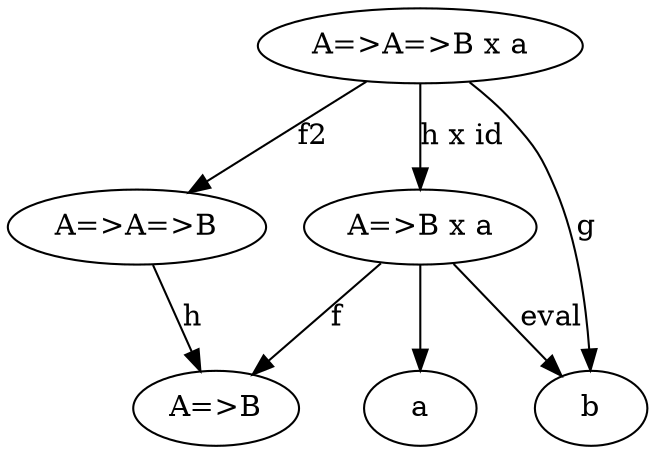
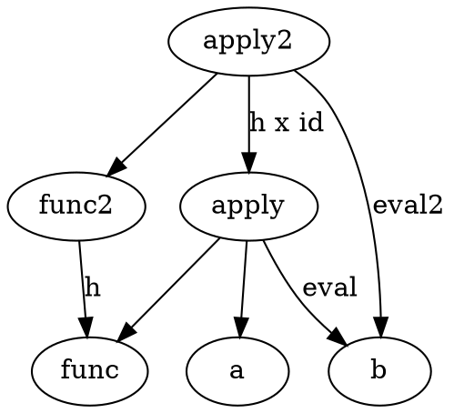

# Function Type



```scala
type A = String
type B = Int
type AB = Function1[A,B]
type AAB = Function2[A,A,B]
type ABxa = (AB, A)
type AABxa = (AAB, A)

def f(in: ABxa): AB = in._1
def f2(in: AABxa): AAB = in._1
def eval(in: ABxa): B = in._1(in._2)
def g(in: AABxa): B = in._1(in._2, in._2)
def h(in: AAB): AB = (a: A) => in(a, a)
def hxid(in: AABxa): ABxa = (h(in._1), identity(in._2))
```

More generally, 


## Currying
AAB from above can be interpreted to be a function that takes two arguments and returns a B. Another view is that AAB is a function that takes an A and returns a function that takes another A and returns B.
```scala
val b: B = 5
val nonCurry: AAB = (a1: A, a2: A) => b

def c(a1: A)(a2: A): B = b
val curry: AAB = c(_)(_)
```

Categorically, another way to define g is like this:
```scala
// g = eval . (h x id)
val g2 = eval _ compose hxid _ // another way to define g
```
So given an h, you should be able to get a g and vice versa. h is a function that returns a function, which is currying.
```scala
// def curry[A,B,C](f: Function2[A, B, C]): Function1[A,Function1[B, C]] = f.curried
def curry[A,B,C](f: Function2[A, B, C]): Function1[A,Function1[B, C]] = (a: A) => (b: B) => f(a, b)
def uncurry[A, B, C](f: Function1[A,Function1[B, C]]): Function2[A, B, C] = (a: A, b: B) => f(a)(b)
```

## Exponential
An object that represens a function (function object) is also referred to as an expoonential. Here's why.

Take the function Bool => Int. This really represents a pair of integers, one for true and one for false:

Bool => Int == (Int, Int)

The pair is really a Cartesian product of Ints and can be represented as (Int x Int) or event Int<sup>2</sup>. Well, the 2 is representative of the type Bool, so we can rewrite as Int<sup>Bool</sup>. And more generally, as long as types are finite, the exponential representation will give you the number of functions the type produces.

