# Natural Transformation
A natural transformation is a mapping between functors which preserves structure.

```graphviz
digraph {
    subgraph cluster_0 {
        label=C
        a
    }

    subgraph cluster_1 {
        label=D
        Fa -> Ga [label=𝛼a]
        a -> Fa [label=F]
        a -> Ga [label=G]
    }
}
```


Objects Fa and Ga have their own set of morphisms, hom<sub>D</sub>(Fa, Ga) independent of the relationship between F and G. The natural transformation simply selects one of the morphisms between them as the mapping.

Morphisms like T are referred to as components of natural transformation. So in the above example, 𝛼a: Fa -> Ga is the a component of natural transformation 𝛼. Result is a family of morphisms making up natural transformation.

Not all functor pairs have a natural transformation.

The above image doesn't address mapping of morphisms yet.

```graphviz
digraph {
    subgraph cluster_0 {
        label=C
        a -> b [label=f]
    }

    subgraph cluster_1 {
        label=D
        Fa -> Ga [label=𝛼a]
        Fb -> Gb [label=𝛼b]
        a -> Fa [label=F]
        a -> Ga [label=G]
        b -> Fb [label=F]
        b -> Gb [label=G]
        Fa -> Fb [label=Ff]
        Ga -> Gb [label=Gf]
    }
}
```


We can extract the following relationship from the above diagram:

```graphviz
digraph {
    Fa -> Fb [label=Ff]
    Fa -> Ga [label=𝛼a]
    Fb -> Gb [label=𝛼b]
    Ga -> Gb [label=Gf]
}
```


If, `Gf o 𝛼a = 𝛼b o Ff` for a mapping between two functors, then it is a natural transformation. This is the naturality condition, and the diagram above is the naturality square. This condition is strong as it must be held true for every object and every morphism between objects.

Another way to view natural transformation is mapping of object to morphism. For example, in the above example, a was mapped to 𝛼a.
Morphisms are mapped to commuting diagrams like the one above.

Commuting diagrams (naturality squares) can be seen as assembly language of cateogry theory.

Natural transformations can be used to definee isomorphisms of functors. Natural isomorphism is defined as a natural transformation whose components are all isomorphisms.

Functors form a category with natural transformations as morphisms. There is a category of functors for each pair of categories C and D.

## Programming View
A natural transformation deals with 2 functors. We know of several in Hask, Option and List for example.

- a: Int type
- b: String type
- F: Option
- G: List
- Fa: Option[Int]
- Fb: Option[String]
- Ga: List[Int]
- Gb: Option[String]
- alphaA: Fa => Ga, Option[Int] => List[Int]
- alphaB: Fb => Gb, Option[String] => List[String]
- f: a => b, Int => String
- Gf o alphaA      (List[Int] => List[String]) compose (Option[Int] => List[Int])      Option[Int] => List[String]
- alphaB o Ff      (Option[String] => List[String]) compose (Option[Int] => Option[String])    Option[Int] => List[String]

```scala
def alpha[A, F[_], G[_]]: F[A] => G[A]
```

Any polymorphic function that has the same type as alpha satisies the naturality condition.
Parametric polymorphism automatically defines natural transformations as a result of theroems for free.
Any parametrically polymorphic function mapping between two functors is a natural transformation.

A functor can be thought of as a container. In that case, natural transformations are the recipes for repackaging the contents of one container into another.
Another way to think of naturalityu is is doesn't matter if modify item first (through f in fmap) and repackage or vice versa.

Since ADTs are functors, any parametric polymorphic function between them is a natural transformation.

Polymorphic functions between contravariant functors are also natural transformations in the opposite category of Hask.